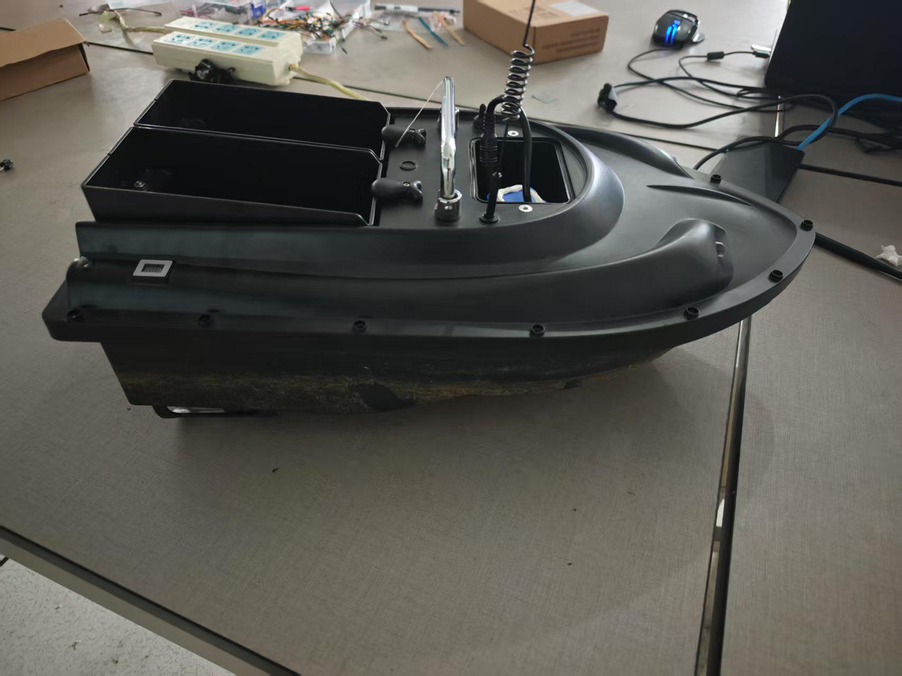
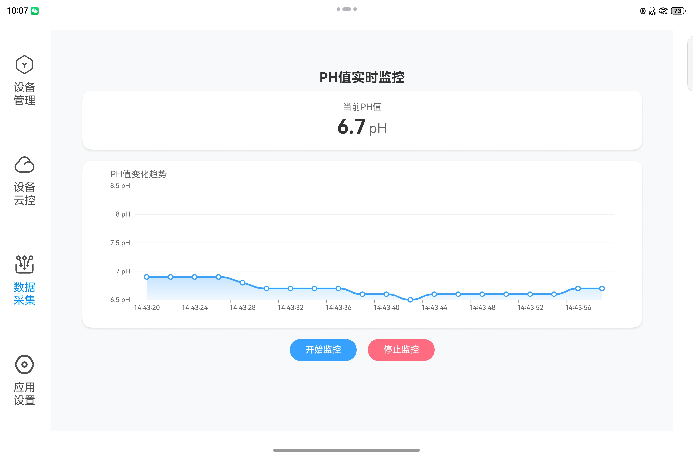

# OpenHarmony unmanned water quality monitoring ship

[简体中文](./README.md) [English](./README-en.md)
-------------------------------------------------

> This warehouse stores three project code files, namely, the core full code base of the unmanned boat based on OpenHarmonyOS on the development board side, the unmanned boat control client based on the pure-blooded Hongmeng HarmonyOS 5.05 NEXT of OpenHarmonyOS, and the full code base of the core self-built server for message forwarding;

### Physical picture of unmanned water quality monitoring ship:

### Actual picture of unmanned boat control client:

