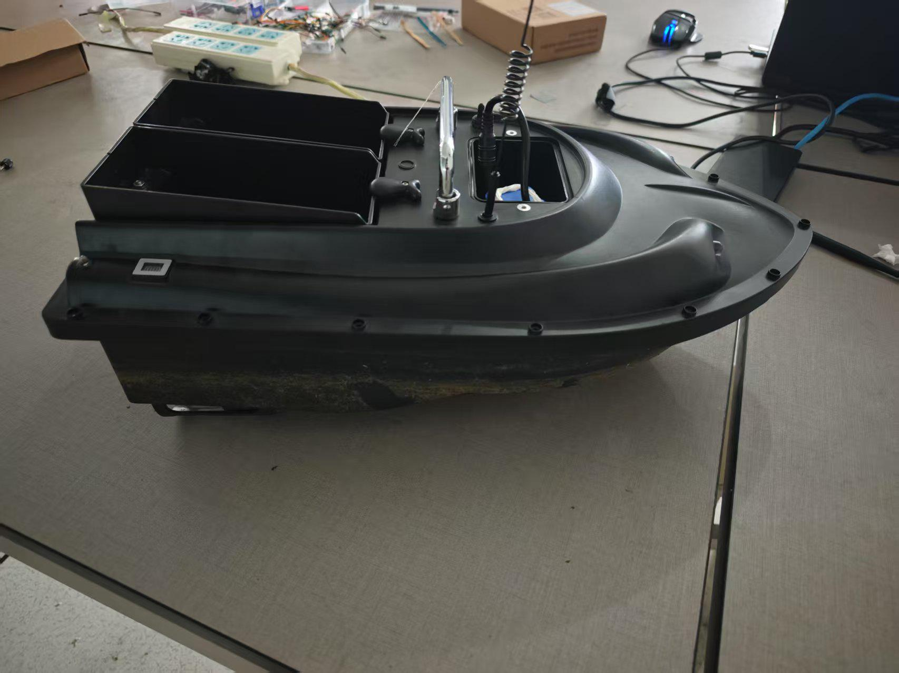
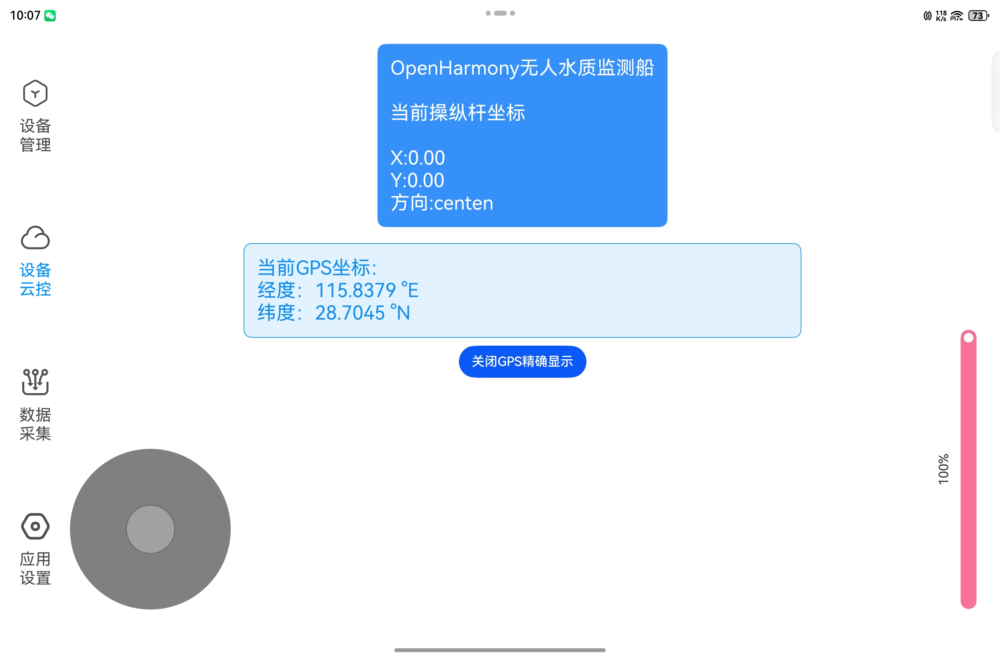
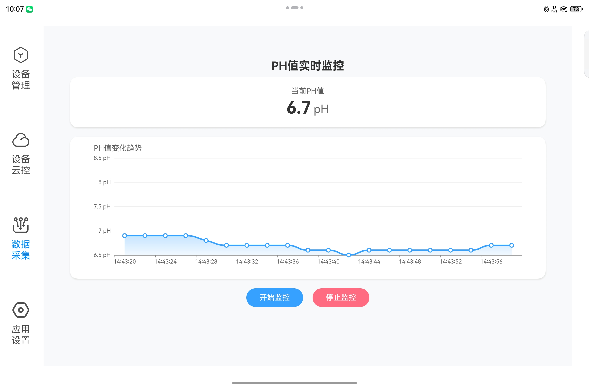
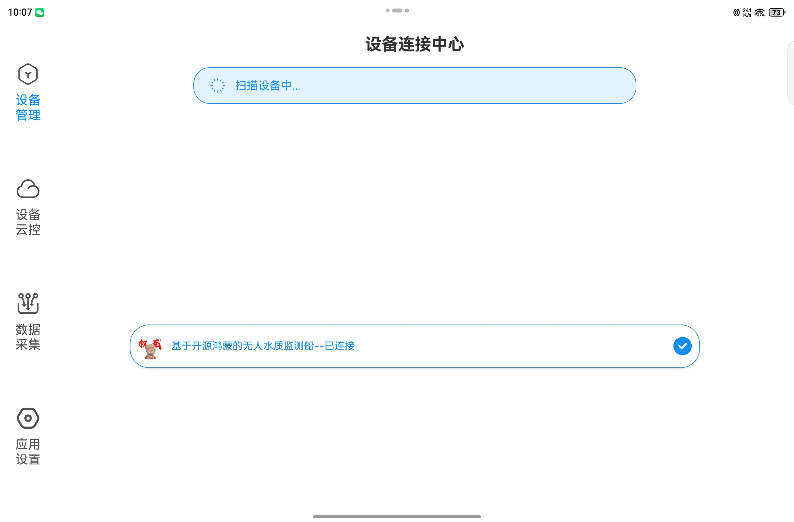

# 开源鸿蒙无人水质监测船

[简体中文](./README.md) [English](./README-en.md)
-------------------------------------------------

> 本仓库存储三个项目代码文件，分别是位于开发板侧的基于OpenHarmonyOS的无人船核心全量代码库、基于OpenHarmonyOS的纯血鸿蒙HarmonyOS 5.05 NEXT的无人船控制客户端、消息转发的核心自建服务器全量代码库；

### 无人水质监测船实物图：

### 无人船控制客户端实机图：

